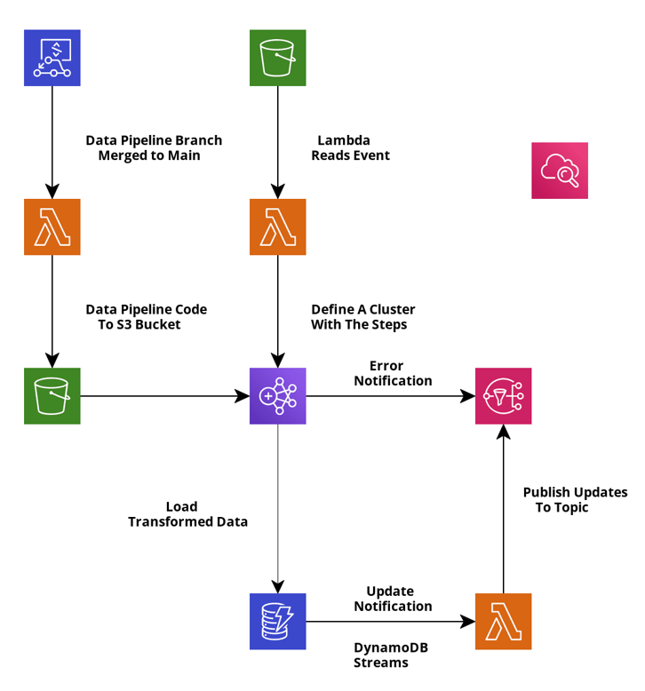
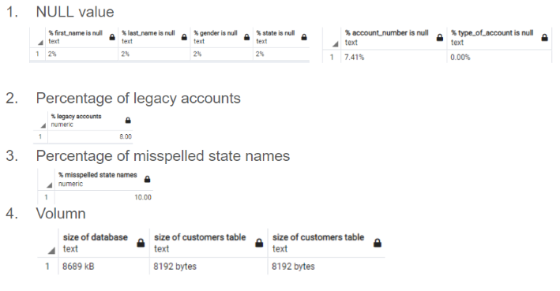

# ETL
This project is a simple automated ETL pipeline using Python, Apache Spark, and Apache Hive on AWS infrastructure. 

## Pipeline Architecture:
> 

## Prerequisites:
> 1. AWS account
>    - region: us-east-1
>    - access: both console and secret key 
> 2. EC2 keypairs
>    - please name the key: ***first***.
> 3. IAM role:
>    - A role with AdministratorAccess to Cloudformation is required for deployment using Codepipeline.    
> 4. Git Credentials
> 5. Set default EC2 roles in case you run into "EMR_DefaultRole is invalid" or "EMR_EC2_DefaultRole is invalid" error. The EMR cluster will be defined using EMR_DefaultRole and EMR_EC2_DefaultRole as service role and job flow role.
> ```
> aws emr create-default-roles
> ```

## Sample Data
> - Data Profiling 
>   - Connect to a PostgreSQL instance using sqlalchemy. See preparation_work/insert_data.ipynb in development branch. 
>   - Read from csv and write to the database 
>   - Use SQL queries to analyze the data. See preparation_work/data_profiling.sql in development branch.   
>    
> - The 5 goals of data transformation
>   - Fill NA for column “firstname", "lastname", "gender", "state", and “account_number”
>   - AACO has some legacy accounts and they would like to convert these to checking accounts for the purpose of analytics 
>   - Some states are spelled wrongly and some are abbreviated. AACO wants to have full state name only. Misspelled name will be replaced with unknown value as they 
>     don’t reflect the actual customers’ geographic segmentation
>   - AACO requires to concat customer’s first and last name for the purpose of analytics 
>   - Add a created_at_year column as we will partition by the year that the accounts were created

## Features
> 1. A lambda function was used to either create EMR cluster once csv files are uploaded to the S3 Bucket if no cluster is in waiting state or attach the steps to a waiting cluster.
> 2. Once data transformation is complete and ready to be write into a DDB table, the hql file will be executed to create one native Hive table and dump processed data into the table. The same file will also create a external table that maps to a DynamoDB table and copy the data from the native Hive table to DDB CustomerAccount table.
> 3. A cloudwatch event rule was set to monitor the event pattern that any EMR cluster state changes to WAITING or TERMINATED_WITH_ERROR and trigger a target action to publish the event to a SNS topic.
> 4. The DDB CusomerAccount table has streams enabled. DDB strams don't invoke Lambda functions directly. A lambda function is mapping to the DDB stream and will be invoked once the number of records in stream event reaches 100 or the batching window reaches 60 seconds (These properties can be configured and adjusted). A message will then be published to a SNS topic. 
> 5. Whenever the scripts files are updated, tested and pushed to the Codecommit repo, a lambda function will be invoked to get the files and put in a designated S3 Bucket upon the push event.

## Deployment
> Only one Cloudformation template is needed for this project. Unfortunately 2 triggers have to be implemented manually after the deployment. One is for feature 5, though this one is understandable, we will have to create repo anyway before deploying. The trigger for feature 1 was to invoke the Lambda function to create EMR cluster once csv files are uploaded to the S3 Bucket B. Due to circular dependency, I was not able to include the notification configuration property under the S3 bucket. See [circular_dependency](https://docs.aws.amazon.com/AWSCloudFormation/latest/UserGuide/aws-properties-s3-bucket-notificationconfig.html).

## Clean Up
> Terminate the EMR cluster   
> Delete all items in DynamoDB table (optional).

*Happy Learning!*
